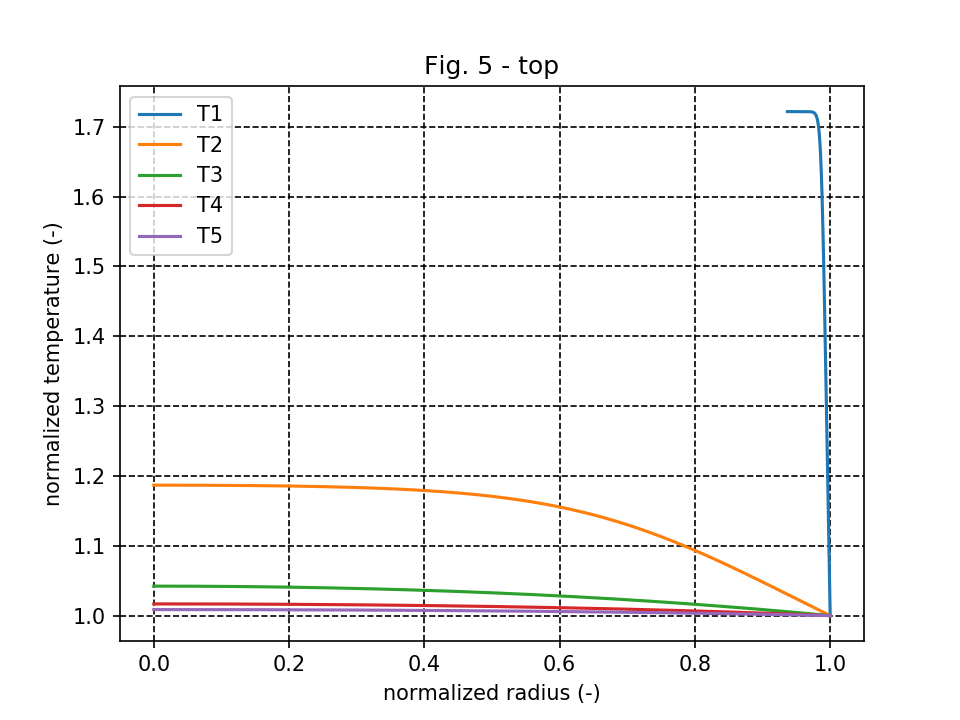
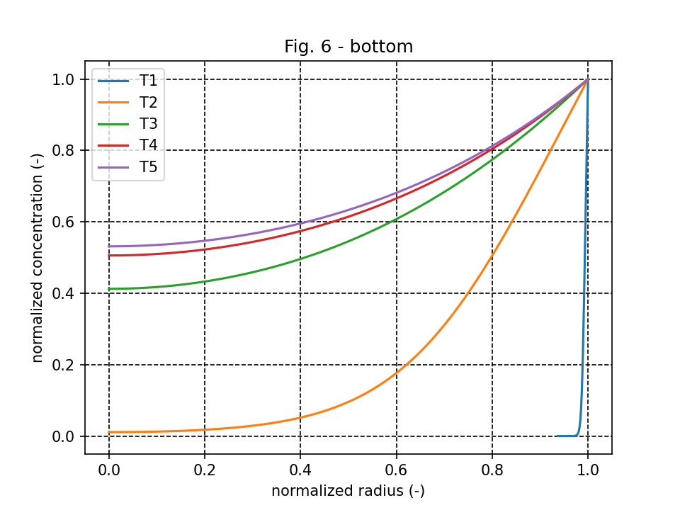

# Solution algorithm for non-isothermal effectiveness factors

The python script implements the algorithom proposed by Lee and Kim [1] and was used for the effectiveness factor calculations in [2]. The implementation works, but it is inefficient (especially the root finding of H1 and H2).

As an example, Figure 5 of [2] is calculated with the code in this folder:

# Description

**LeeSolver.py** implements the solver class *nonIsothermal* to solve for non-isothermal effectiveness factors. **example.py** explains how to use the solver class based on Fig. 4 and Fig. 5 of [2].

An analogue solver class for isothermal effectiveness factors (called *isothermal*) based on *scipy solve_ivp* is also in the **LeeSolver.py** file, but there are some issues when passing arguments to the boundary condition function (*bc*). 

Both implementations can currently only solve effectiveness factors in spherical particles.

**Tested/required module versions:**
* numpy 1.17.3
* scipy 1.4.1
* mbl 3.2.2
* pandas 1.0.0

# References

[1] Lee, J., and Kim, DH (2005): An improved shooting method for computation of effectiveness factors in porous catalysts, Chemical Engineering Science, vol. 60(20), pp. 5569-5573, DOI: [10.1016/j.ces.2005.05.027](https://www.doi.org/10.1016/j.ces.2005.05.027).

[2] Bösenhofer, M. and Harasek, M. (2021): Non-isothermal effectiveness factors in thermo-chemical char conversion, Carbon Resources Conversion, in press, DOI: [10.1016/j.crcon.2021.01.004](https://www.doi.org/10.1016/j.crcon.2021.01.004).
